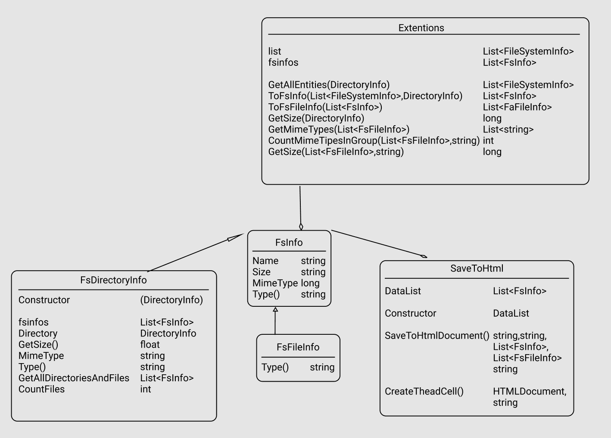

# FSImageTo

В переносимой библиотеке использовался крошечный маппер mime типов: [github](https://github.com/zone117x/MimeMapping)

Так-же использовалась библиотека Aspose.html для сохранения html отчета: [nuget](https://www.nuget.org/packages/Aspose.HTML/21.9.0/ReportAbuse)

В пректе используются **_CDN Bootstrap._** Для корректного отображения html таблицы необходимо минимальное подключение к интернету.

Была создана отдельная переносимая **DotNet Standart** библиотека для использования кодовой базы в других проектах.  
Приложение было сделано на **Dotnet 5** с использованием **WinForms core**.  

**Инструменты:** Visual Studio Community 2019, GitHub.

Диаграмма классов: 
